## 섹션 1.5 수행내역  

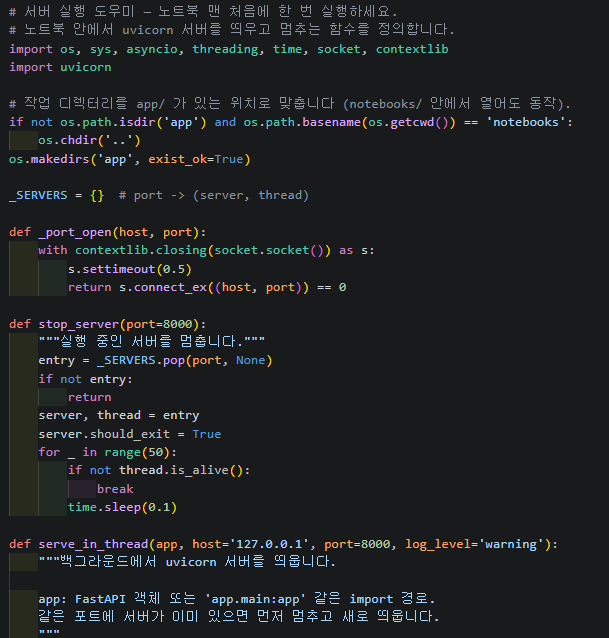  
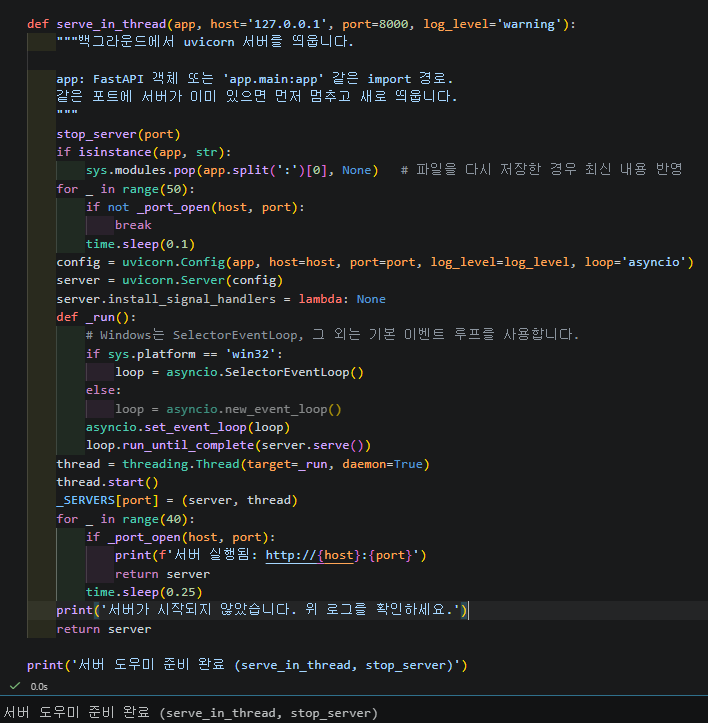  
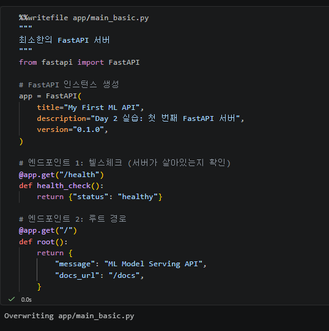  
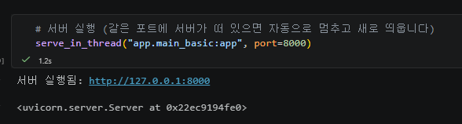  
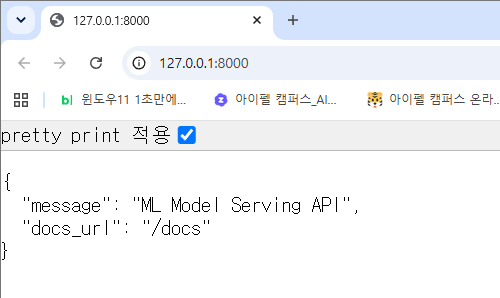  
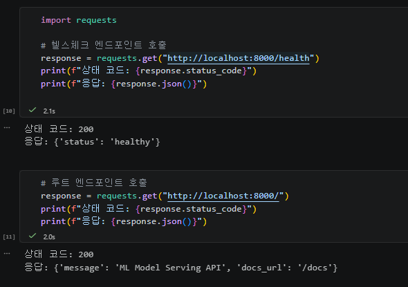  

## 섹션 2 수행내역 

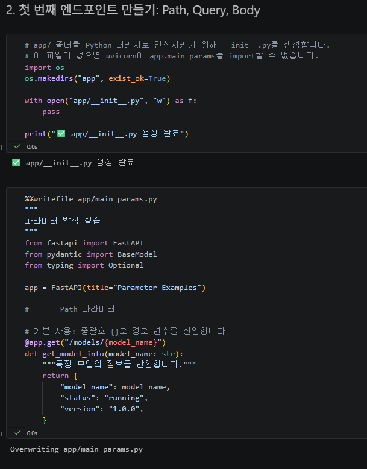  
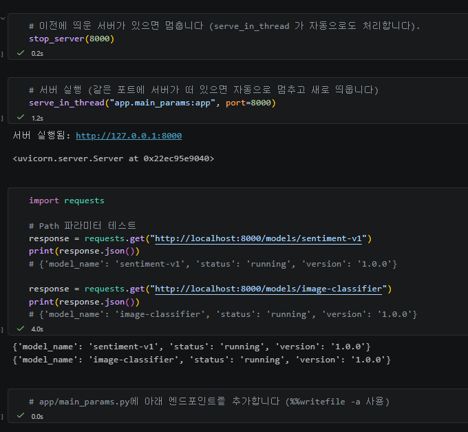  
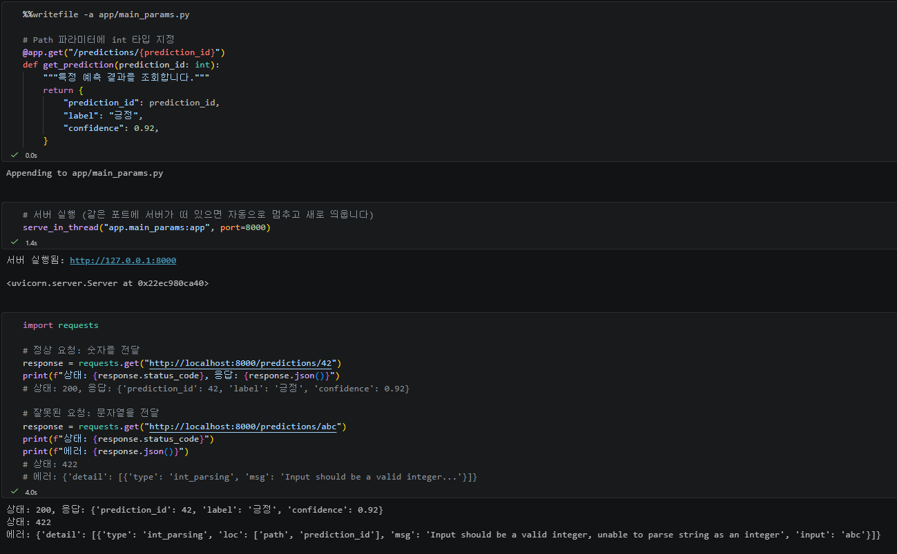  
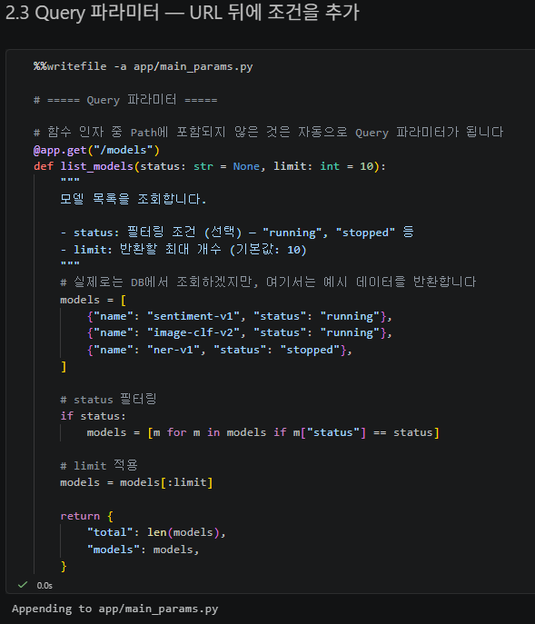  
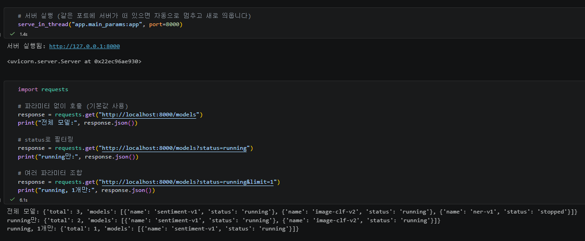  
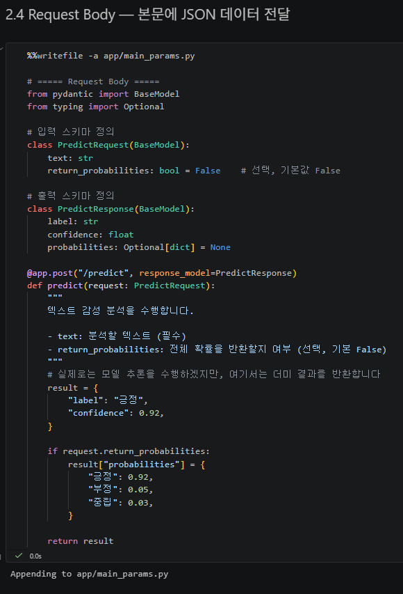  
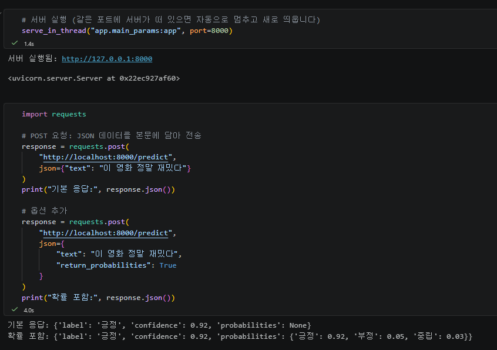  
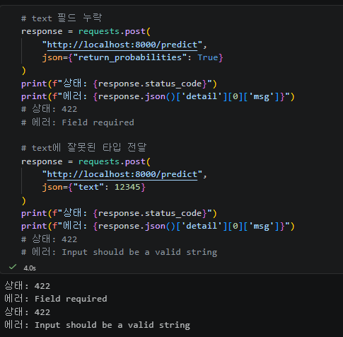  

## 섹션 3 수행내역  

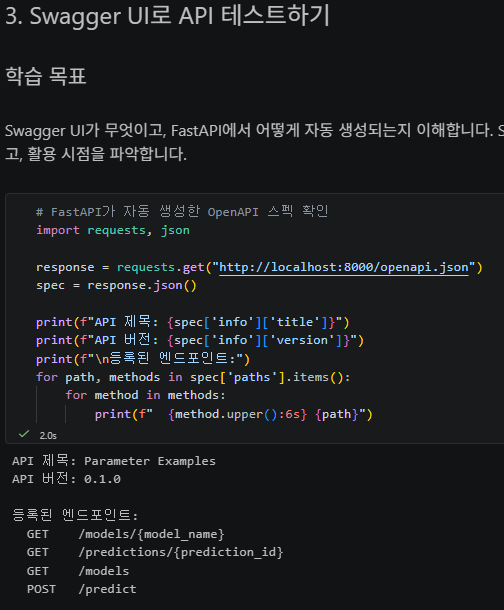  
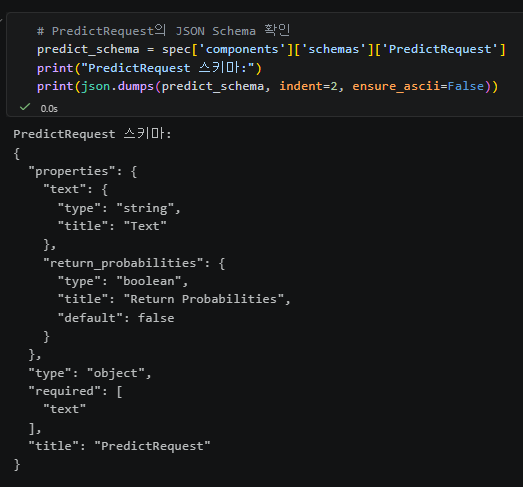  
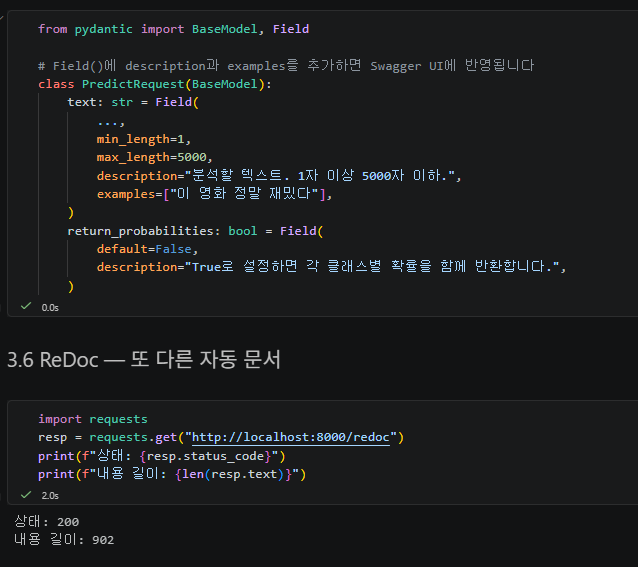  

## 섹션 5 수행내역  

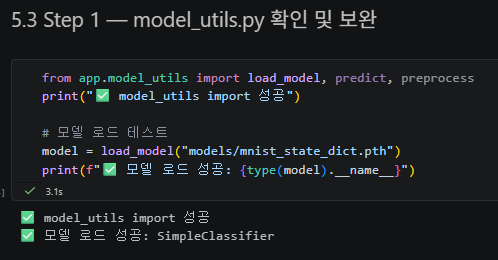  
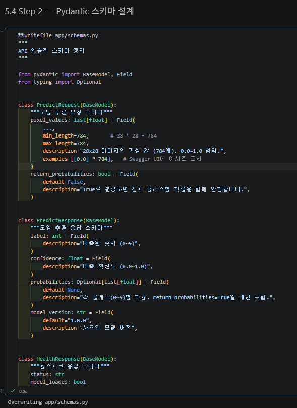  
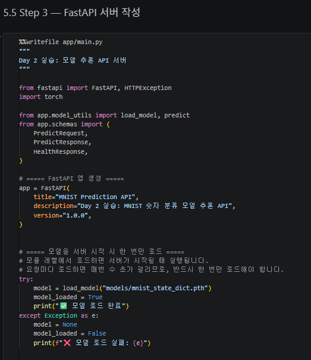  
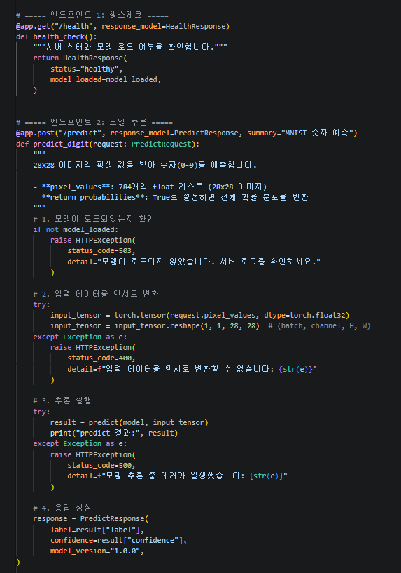  
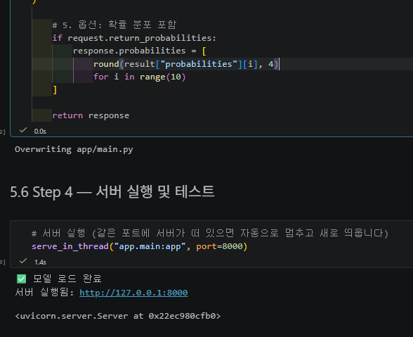  
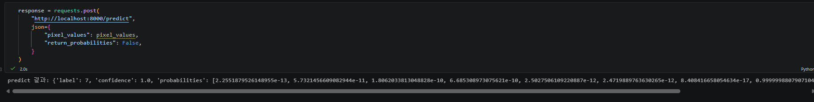  
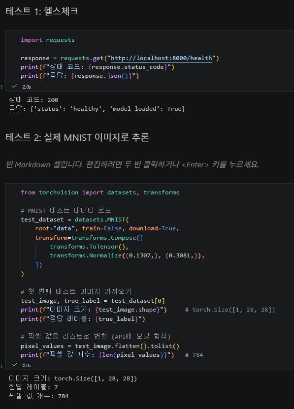  
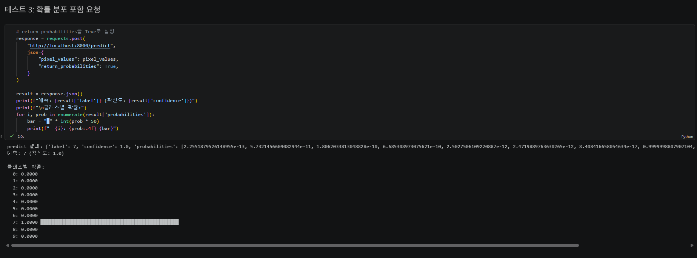  
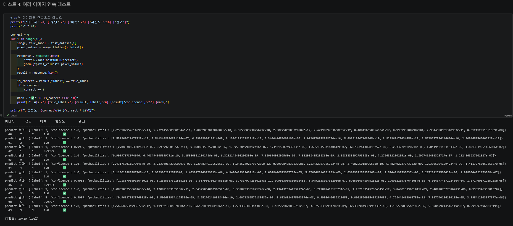  
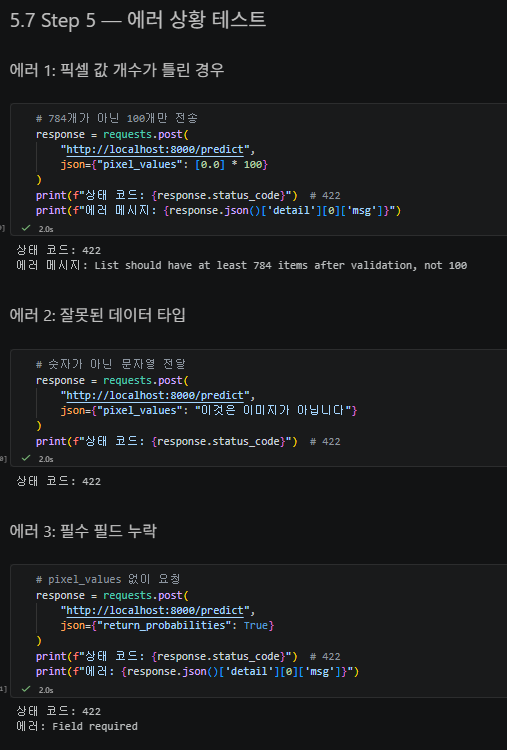  
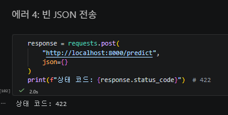  
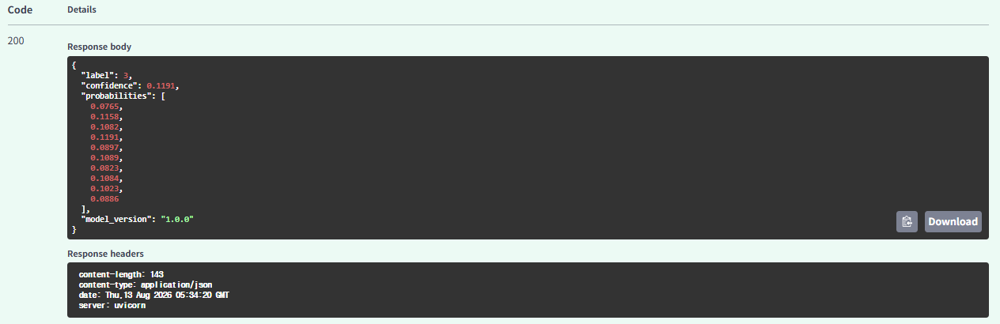  

## 각 섹션 체크포인트의 답변  

### 섹션1  
#### 1. FastAPI가 Flask보다 모델 배포에 적합한 이유 세 가지는 무엇입니까?  
1) 자동 데이터 검증: Pydantic을 이용해 입력 데이터를 자동으로 검증합니다.  
2) 자동 API 문서화: Swagger UI를 자동으로 생성하여 /docs에서 API를 확인하고 테스트할 수 있습니다.  
3) 비동기 처리: async/await 기반으로 여러 요청을 효율적으로 처리할 수 있습니다.  
  
#### 2. Uvicorn의 역할은 무엇이며, 왜 FastAPI와 함께 사용합니까?  
Uvicorn은 ASGI 서버로, 클라이언트의 HTTP 요청을 받아 FastAPI 애플리케이션에 전달합니다.  
FastAPI는 API의 라우팅·검증·응답 등을 담당하지만 자체적으로 HTTP 요청을 받아주는 서버가 아니기 때문에 Uvicorn과 함께 사용합니다.  

#### 3. @app.get("/health")에서 get과 "/health"는 각각 무엇을 의미합니까?  
get → HTTP GET 메서드  
"/health" → 요청을 받을 URL 경로(Path)  
따라서 GET /health 요청이 들어오면 바로 아래에 있는 함수가 실행됩니다.  

#### 4. FastAPI에서 dict를 반환하면 어떤 일이 자동으로 일어납니까?  
Python의 dict를 반환하면 FastAPI가 자동으로 JSON 형식으로 변환하여 HTTP 응답으로 보냅니다.  
따라서 json.dumps()를 직접 사용할 필요가 없습니다.  

### 섹션2  
#### 1. /models/sentiment-v1에서 sentiment-v1은 어떤 종류의 파라미터입니까?  
Path 파라미터입니다.  
특정 모델처럼 특정 리소스를 식별하기 위해 URL 경로 안에 값을 넣는 방식입니다.  

#### 2. /models?status=running&limit=5에서 status와 limit은 어떤 종류의 파라미터입니까?  
둘 다 Query 파라미터입니다.  
URL 뒤의 ? 다음에 key=value 형식으로 전달되며 주로 검색, 필터링, 옵션, 페이지네이션 등에 사용됩니다.  

#### 3. 모델 추론 요청에 Request Body를 사용하는 이유는 무엇입니까?  
모델 추론에서는 텍스트, 이미지 픽셀, 옵션 등 복잡하고 구조화된 데이터나 많은 양의 데이터를 전달해야 하기 때문입니다.  
Request Body를 사용하면 데이터를 JSON 형태로 전달할 수 있으며 URL 길이 제한에도 영향을 받지 않습니다.  

#### 4. FastAPI에서 함수의 파라미터가 Path, Query, Body 중 어디서 오는지 어떻게 판별합니까?  
FastAPI는 함수의 선언 형태와 타입 힌트를 보고 자동으로 판단합니다.  
- URL 경로에 {model_name}처럼 선언되어 있으면 → Path  
- 경로에는 없고 limit: int = 10 같은 일반 파라미터이면 → Query  
- request: PredictRequest처럼 Pydantic BaseModel을 사용하면 → Request Body

### 섹션3
#### 1. FastAPI에서 Swagger UI에 접속하려면 어떤 URL로 이동합니까?  
로컬 환경에서는 다음 주소입니다.  
http://localhost:8000/docs  
즉, 기본적으로 FastAPI 서버 주소 뒤에 **/docs**를 붙입니다.  

#### 2. Swagger UI가 코드와 항상 동기화될 수 있는 이유는 무엇입니까?  
FastAPI가 코드의 타입 힌트, Pydantic 모델, 엔드포인트 정보 등을 이용하여 OpenAPI 스펙을 자동 생성하고, Swagger UI가 그 정보를 읽어 문서를 만들기 때문입니다.  
따라서 Pydantic 모델이나 API 코드를 수정하면 문서도 자동으로 변경됩니다.  

#### 3. Pydantic 모델의 Field(description=, examples=)는 Swagger UI의 어디에 반영됩니까?  
Swagger UI의 Request Body 입력 스키마와 필드 설명/예시에 반영됩니다.  
- description → 해당 필드가 무엇인지 설명  
- examples → Request Body에 사용할 수 있는 입력 예시  
즉 API 사용자가 Swagger UI에서 각 입력값의 의미와 예시를 확인할 수 있게 됩니다.

#### 4. Swagger UI와 ReDoc의 핵심 차이는 무엇입니까?  
가장 큰 차이는 API를 직접 실행할 수 있느냐입니다.  
- Swagger UI (/docs) → Try it out으로 API를 직접 호출 가능 → 개발·테스트 중심  
- ReDoc (/redoc) → API를 직접 호출하지 않고 조회 → 읽기·외부 공유용 문서 중심  
노트북에서도 Swagger UI는 개발자(내부), ReDoc은 **클라이언트(외부)**에 더 적합하다고 정리하고 있습니다.

### 섹션4
#### 1. text: str과 text: str = "기본값"의 차이는 무엇입니까?  
text: str = 필수 필드입니다. 값을 보내지 않으면 검증 에러가 발생합니다.  
text: str = "기본값" = 선택적 필드입니다. 값을 보내지 않으면 "기본값"이 자동으로 사용됩니다.  

#### 2. Field(..., min_length=1, max_length=5000)에서 ...은 무엇을 의미합니까?  
...은 해당 필드가 필수(required)라는 뜻입니다.  
즉 반드시 값을 전달해야 합니다.  
text가 없으면 검증에 실패합니다.  

#### 3. 422 에러 응답에서 loc 필드는 어떤 정보를 담고 있습니까?  
loc은 에러가 발생한 위치를 알려줍니다.  

#### 4. response_model을 지정하면 어떤 이점이 있습니까?  
노트북에서는 세 가지를 설명합니다.  
- Swagger UI에 응답 스키마가 자동으로 문서화됩니다.  
- 스키마에 정의되지 않은 필드는 응답에서 자동으로 제거됩니다.  
- 내부 데이터가 실수로 클라이언트에 노출되는 것을 방지할 수 있습니다.  

### 섹션5  
#### 1. 모델을 서버 시작 시 한 번만 로드해야 하는 이유는 무엇입니까?  
모델 로드는 파일 I/O가 포함된 무거운 작업이기 때문입니다.  
요청이 들어올 때마다 모델을 다시 로드하면 매 요청마다 수 초가 걸릴 수 있어 응답 속도가 매우 느려집니다.  

#### 2. pixel_values가 784개가 아닌 요청이 들어오면 어떤 일이 발생합니까? 이를 처리하는 코드를 직접 작성했습니까?  
Pydantic이 요청을 자동으로 거부하고 HTTP 422 Validation Error를 반환합니다.  
스키마가 다음과 같이 정의되어 있기 때문입니다.  
pixel_values: list[float] = Field(  
    ...,  
    min_length=784,  
    max_length=784,  
)  
따라서 100개처럼 784개가 아닌 값이 들어오면 모델까지 전달되지 않습니다.  
별도의 if len(pixel_values) != 784 같은 검증 코드를 직접 작성하지 않았습니다.  
784개라는 조건만 Pydantic 스키마에 선언했고, 실제 검증과 422 응답은 Pydantic + FastAPI가 자동 처리합니다.  

#### 3. HTTPException(status_code=503)은 어떤 상황에서 사용했습니까? 왜 500이 아니라 503입니까?  
모델이 정상적으로 로드되지 않았을 때 사용했습니다.  
if not model_loaded:  
    raise HTTPException(  
        status_code=503,  
        detail="모델이 로드되지 않았습니다."  
    )  
503 Service Unavailable은 서버는 실행 중이지만 모델을 사용할 수 없어 현재 요청을 정상 처리할 수 없는 상황을 나타냅니다.  
반면 노트북에서는 실제 **모델 추론 과정에서 예상하지 못한 서버 내부 오류가 발생했을 때 500 Internal Server Error**를 사용합니다.  

#### 4. Swagger UI에서 PredictRequest의 description과 examples가 어디에 표시됩니까  
POST /predict의 Request Body 입력 스키마에 반영됩니다.  
pixel_values: list[float] = Field(  
    ...,  
    description="28x28 이미지의 픽셀 값 (784개). 0.0~1.0 범위.",  
    examples=[[0.0] * 784],  
)  
라고 작성하면 Swagger UI에서:  
- description → pixel_values가 어떤 데이터인지에 대한 설명  
- examples → Request Body에 사용할 수 있는 예시 데이터  
로 표시됩니다.
