# 모델배포 04  
## 섹션 05  
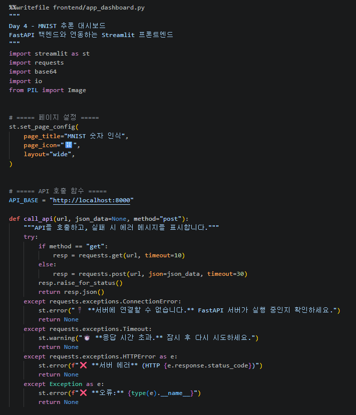  
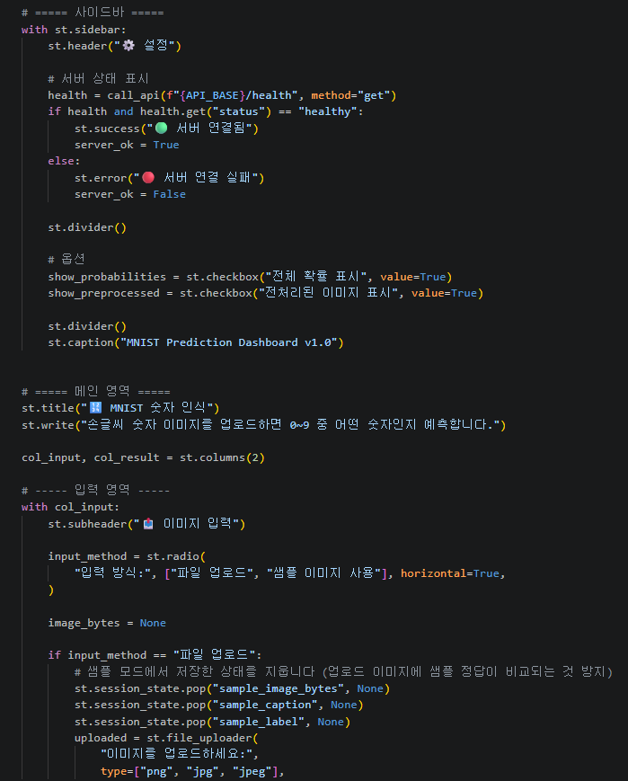  
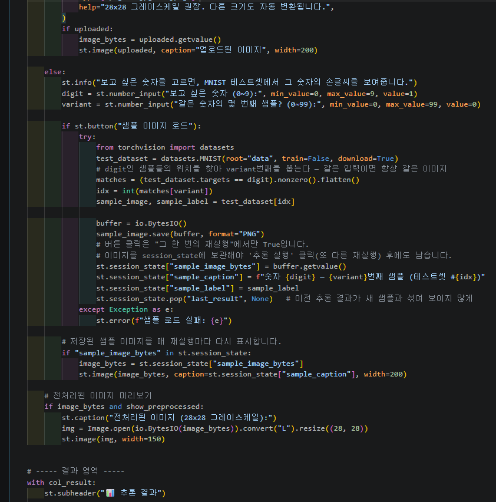  
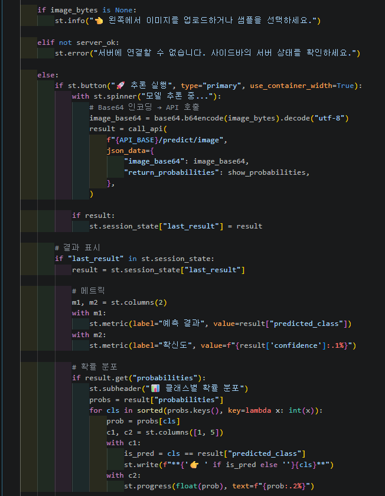  
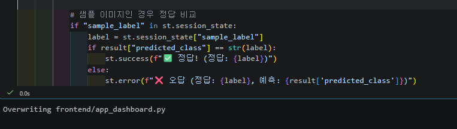  
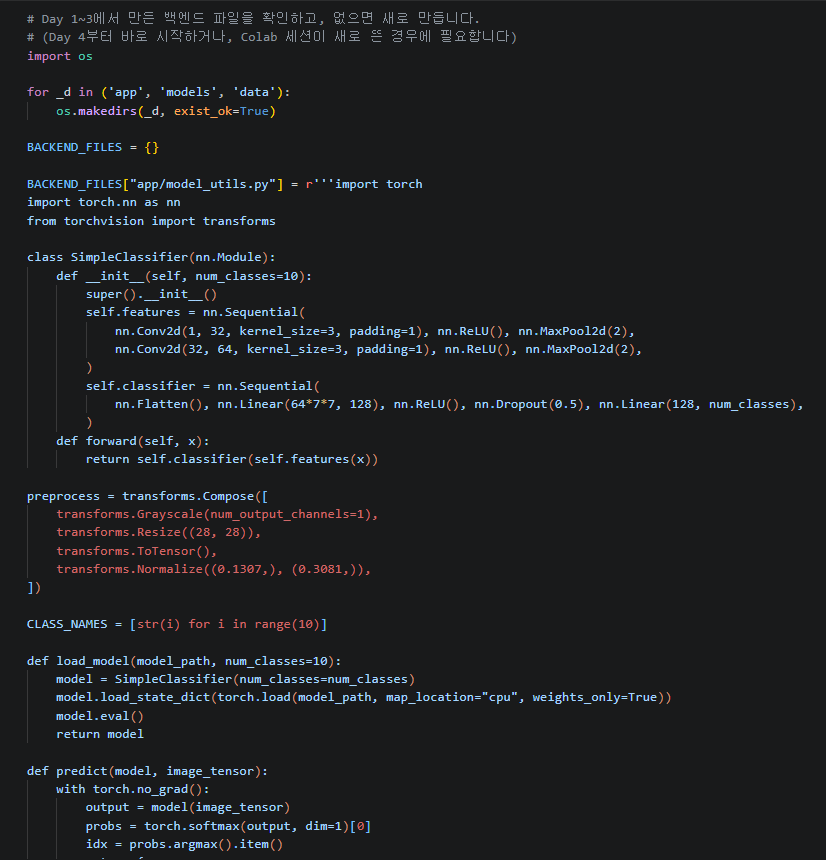  
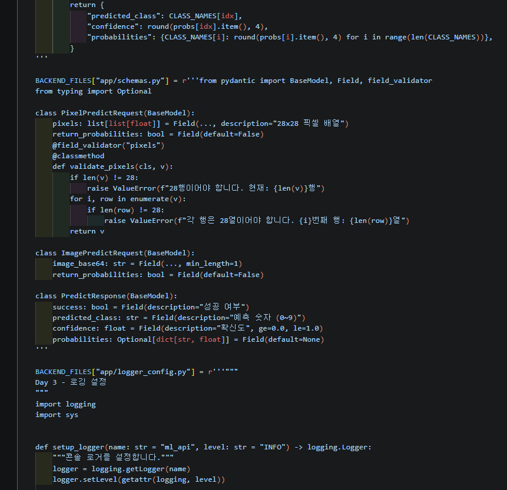  
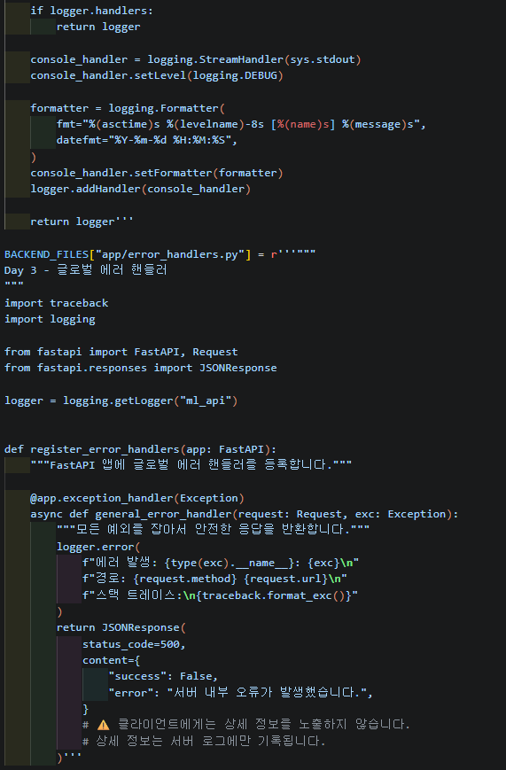  
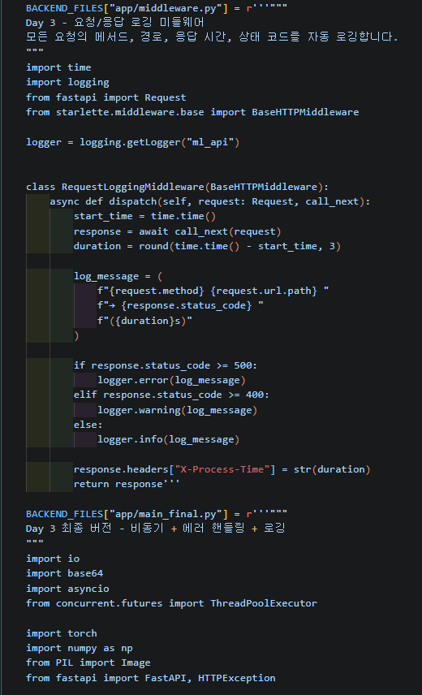  
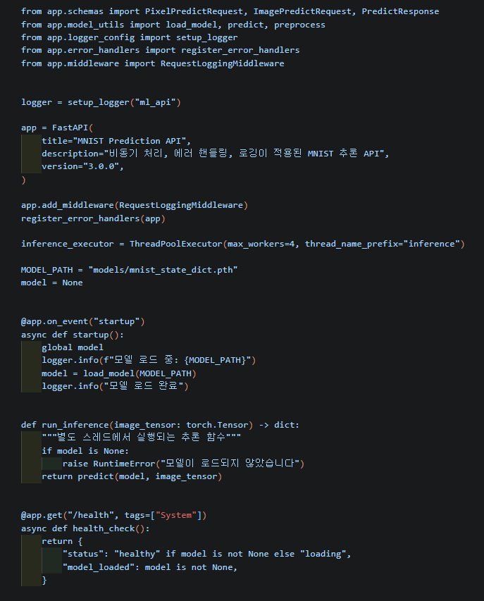  
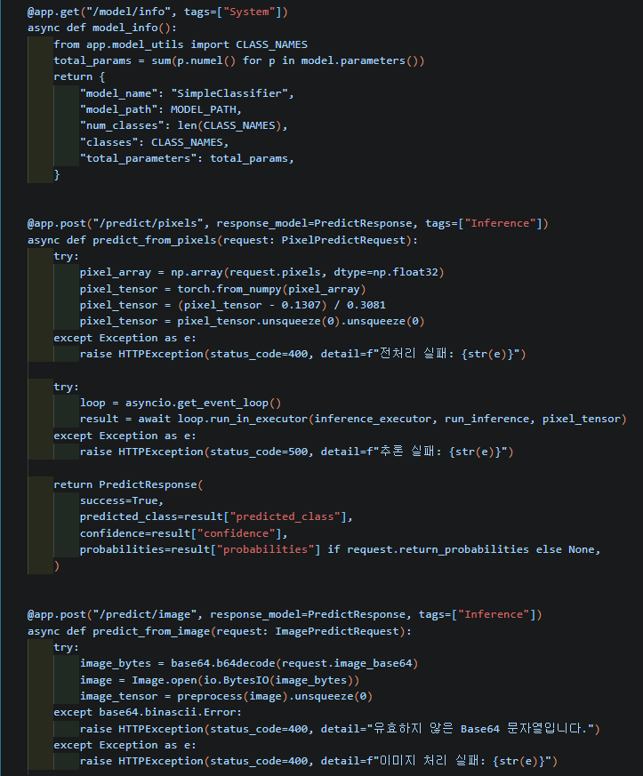  
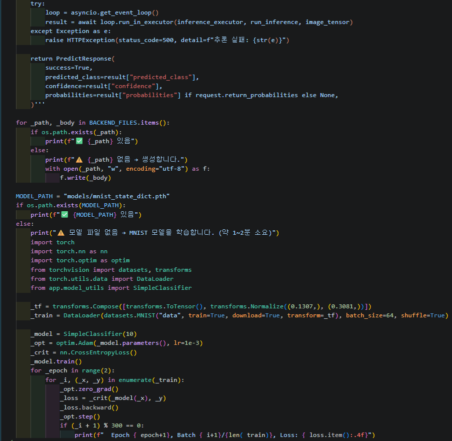  
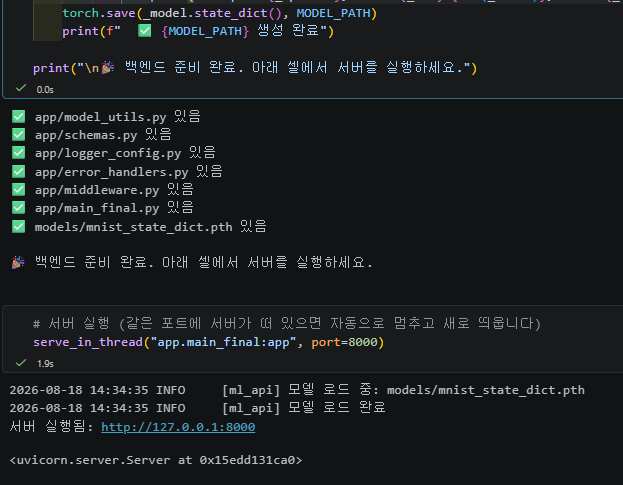  
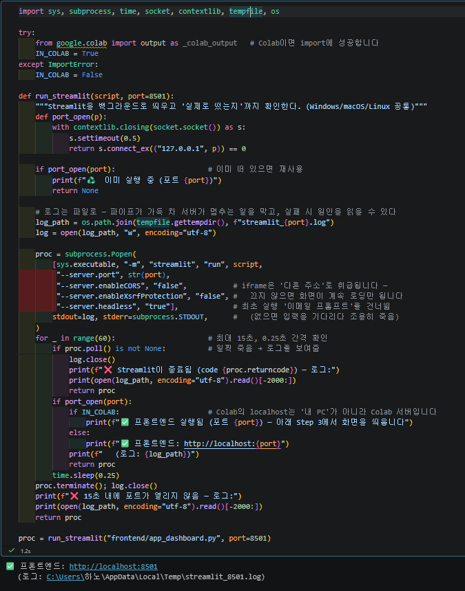  
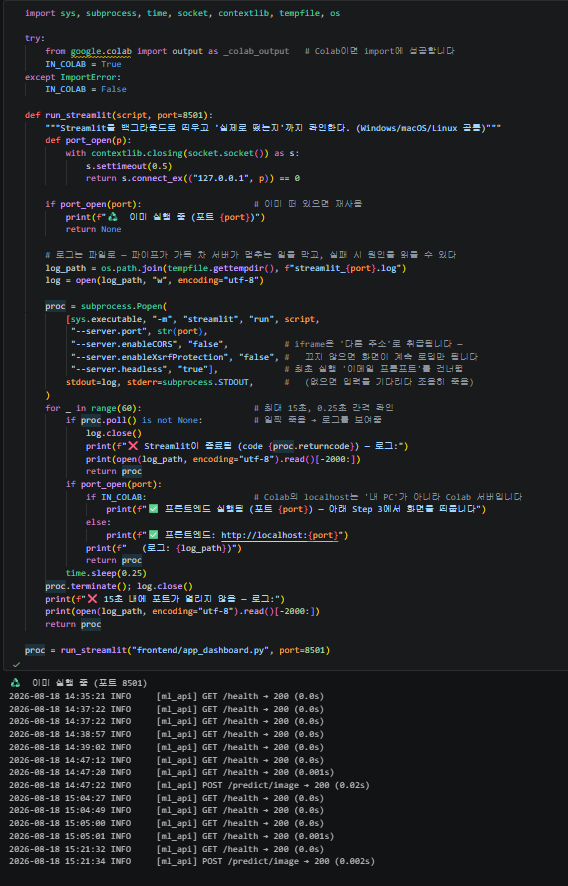  
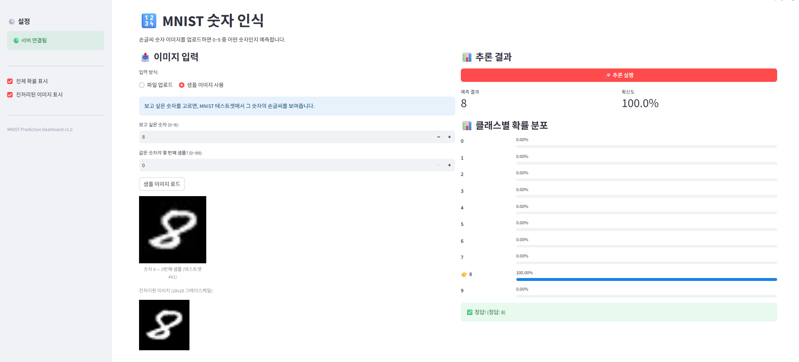  

## 체크포인트 답변  
### 섹션 01  
1. Streamlit의 스크립트 재실행 모델이란 무엇입니까?  
사용자가 버튼을 누르거나 입력값을 바꾸는 등 위젯과 상호작용할 때마다,  
Streamlit이 파이썬 스크립트를 위에서 아래까지 다시 실행하는 방식이다.  

2. st.text_input()에 값을 입력하면 내부적으로 어떤 일이 일어납니까?  
입력값이 바뀌면 Streamlit이 스크립트를 다시 실행하고, 재실행된 st.text_input()은 새 입력값을 반환한다.  

3. st.set_page_config()를 스크립트 중간에 호출하면 어떻게 됩니까?  
다른 Streamlit 명령 뒤에 호출하면 오류가 발생한다. st.set_page_config()는 첫 번째 Streamlit 명령으로 작성해야 한다.  

### 섹션 02  
1. st.file_uploader()로 업로드된 파일의 바이트 데이터는 어떻게 얻습니까?  
업로드 객체의 getvalue()를 사용한다.  

2. Streamlit에서 @st.cache_resource를 사용하는 이유는 무엇입니까?  
스크립트가 재실행돼도 API 클라이언트처럼 한 번 만든 객체를 재사용하기 위해 사용한다. 불필요한 객체 생성을 줄일 수 있다.

### 섹션 03 

1. 모놀리식과 분리 아키텍처의 핵심 차이를 한 문장으로 설명하세요.  
모놀리식은 화면·API·모델이 하나의 애플리케이션에 함께 있고,  
분리 아키텍처는 화면(Streamlit)과 모델 API(FastAPI)를 독립된 서버로 나눈 구조이다.  

2. 모델을 업데이트할 때, 분리 아키텍처에서는 어떤 서버만 재배포하면 됩니까?  
모델을 실행하는 FastAPI 백엔드 서버만 재배포하면 된다.  

3. Streamlit 앱에 PyTorch가 설치되어 있지 않아도 되는 이유는 무엇입니까?  
Streamlit은 모델을 직접 실행하지 않고 FastAPI에 HTTP 요청을 보낸 뒤 JSON 결과만 받아 화면에 표시하기 때문이다.  

### 섹션 04  
1. 이미지를 API에 전송할 때 Base64로 인코딩하는 이유는 무엇입니까?  
이미지는 바이너리 데이터라 JSON에 바로 넣을 수 없다.  
Base64로 텍스트 문자열로 변환하면 JSON 요청에 안전하게 담아 전송할 수 있다.  

2. response.raise_for_status()는 어떤 역할을 합니까?  
응답 상태 코드가 4xx 또는 5xx이면 오류를 발생시킨다. 따라서 실패한 API 요청을 try/except에서 처리할 수 있다.

### Day 4 최종 체크포인트  
[섹션 1: Streamlit 소개]  
Q1. Streamlit의 스크립트 재실행 모델이란?  
Streamlit은 위젯 상호작용마다 스크립트를 처음부터 다시 실행한다.  

[섹션 2: 핵심 컨셉]
Q2. @st.cache_resource를 사용하는 이유는?  
@st.cache_resource는 재실행 중에도 API 클라이언트 같은 자원 객체를 재사용하기 위해 사용한다.  

[섹션 3: System Architecture]
Q3. 프론트엔드와 백엔드를 분리하는 핵심 이유 두 가지는?  
프론트엔드와 백엔드를 분리하면 각각 독립적으로 수정·배포·확장할 수 있고,  
화면과 모델 추론의 역할이 분명해져 유지보수가 쉬워진다.  

Q4. Streamlit 앱에 PyTorch가 필요 없는 이유는?  
Streamlit은 FastAPI에 요청하고 결과 JSON을 표시할 뿐 모델을 직접 실행하지 않으므로 PyTorch가 필요 없다.  

[섹션 4: API 호출]
Q5. API 호출 실패 시 사용자에게 스택 트레이스가 아닌 메시지를 보여줘야 하는 이유는?  
스택 트레이스는 사용자에게 어렵고 내부 구현 정보를 노출할 수 있다. 대신 이해하기 쉬운 오류 메시지를 보여줘야 한다.  

[섹션 5: 실습]
Q6. st.session_state에 결과를 저장하는 이유는?  
버튼 클릭 때마다 스크립트가 재실행되므로, 예측 결과가 사라지지 않게 st.session_state에 저장한다.  

Q7. 이미지를 API로 전달할 때 Base64 인코딩이 필요한 이유는?  
이미지의 바이너리 데이터를 JSON 요청 본문에 넣어 FastAPI로 전송하기 위해 Base64 인코딩을 사용한다.  
