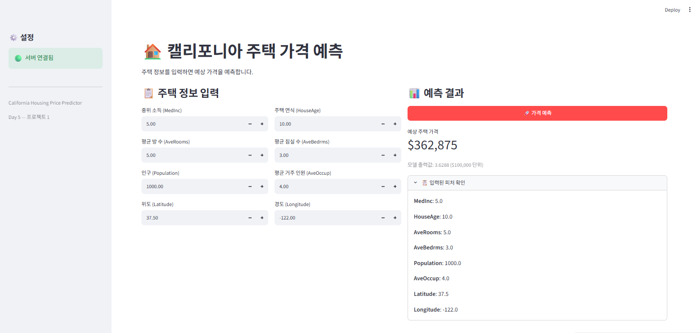

  
## 회고: 무엇이 어려웠고, 어떻게 개선할 수 있는가?  
가장 어려웠던 점은 학습한 모델과 배포 환경의 모델 구조를 일치시키는 일이었다. 모델 구조를 64 → 32 → 1에서 128 → 64 → 1로 변경한 뒤 학습 모델을 저장했지만,  
추론 모듈의 HousingModel은 이전 구조를 유지해 load_state_dict에서 가중치 크기 불일치 오류가 발생했다.  
PyTorch의 .pth 파일에는 기본적으로 가중치만 저장되므로, 학습과 추론에서 모델 레이어 구성이 완전히 같아야 한다는 점을 확인했다.  
이를 개선하려면 모델 구조를 학습 코드와 추론 코드에 중복해서 작성하지 않고,  
하나의 공통 모듈에서 관리해야 한다. 또한 가중치뿐 아니라 모델 설정값도 함께 저장하면 안전하다.  

두 번째 어려움은 Jupyter 커널과 가상환경의 차이였다. .venv에는 torch가 설치되어 있어도,  
노트북이 다른 Python 커널을 사용하면 ModuleNotFoundError가 발생할 수 있다.  
앞으로는 노트북에서 아래 코드로 현재 실행 환경을 먼저 확인하고, 패키지는 %pip install로 설치하겠다.  

세 번째는 학습과 추론의 전처리 일관성이다.  
학습 데이터의 평균과 표준편차로 정규화한 뒤, 이 값을 JSON으로 저장하고 API 추론에서도 재사용해야 한다.  
학습과 추론의 전처리가 달라지면 모델 성능이 크게 떨어질 수 있다. 이후에는 로그 변환, 이상치 처리 여부도 전처리 정보와 함께 저장할 계획이다.  
성능 면에서는 테스트 MAE가 약 $39,292였다.  
이후에는 검증 세트를 분리하고 Early Stopping을 적용하며, Dropout, 학습률, 배치 크기, AdamW, HuberLoss를 비교해 개선하겠다.  
또한 정형 데이터에서는 트리 기반 모델이 강할 수 있으므로 HistGradientBoostingRegressor 같은 모델과 성능을 비교하겠다.  

## 체크포인트  
### 섹션2  
1. 정규화에서 학습 데이터의 통계를 테스트 데이터에도 사용하는 이유는 무엇입니까?  
학습 데이터의 평균과 표준편차를 테스트 데이터에도 사용해야, 모델이 실제 배포 환경과 같은 기준으로 테스트되기 때문입니다.  
테스트 데이터의 통계를 별도로 사용하면 테스트 데이터 정보를 미리 활용하는 데이터 누수가 발생합니다.  

2. 모델 가중치 외에 함께 저장해야 하는 것은 무엇이고, 왜 필요합니까?  
모델 가중치 외에 mean, std, feature_names를 저장해야 합니다.  
추론 때 학습과 같은 정규화와 피처 순서를 적용해야 정확한 예측이 가능하기 때문입니다.  

3. HousingPredictor.predict()에서 피처를 self.feature_names 순서로 배열하는 이유는?  
모델은 입력값의 “이름”이 아니라 배열의 “순서”를 기준으로 학습합니다.  
따라서 MedInc 자리에 Latitude 등이 들어가면 오류가 나지 않아도 전혀 잘못된 예측이 나옵니다.  

### 섹션3  
1. HousingRequest에서 Latitude에 ge=32, le=42 제한을 넣은 이유는?  
Latitude의 ge=32, le=42는 캘리포니아의 현실적인 위도 범위만 허용하기 위한 검증입니다.  
잘못된 위치나 학습 범위를 크게 벗어난 입력을 미리 차단합니다.  

2. request.model_dump()는 어떤 역할을 합니까?  
request.model_dump()는 Pydantic의 HousingRequest 객체를 일반 Python 딕셔너리로 변환합니다.  
변환된 딕셔너리는 predictor.predict()에 전달하기 쉽습니다.  

3. run_in_executor를 사용하지 않으면 어떤 문제가 발생할 수 있습니까?  
run_in_executor를 제거하면 PyTorch 추론 같은 CPU 작업이 FastAPI의 이벤트 루프를 직접 점유합니다.  
한 요청이 처리되는 동안 다른 요청의 응답이 지연되어 동시 처리 성능이 떨어질 수 있습니다.  

### 섹션4  
1. MNIST 대시보드(Day 4)와 비교했을 때 입력 방식이 어떻게 다릅니까?  
MNIST는 이미지 또는 손글씨 데이터를 입력으로 사용하지만,  
주택 가격 프로젝트는 소득·방 수·인구·위도·경도처럼 여러 개의 숫자형 정형 데이터를 직접 입력합니다.  

2. st.number_input()에서 min_value, max_value를 설정하는 이유는?  
min_value, max_value는 사용자가 비정상적이거나 의미 없는 값을 입력하는 것을 줄이고,  
API의 입력 검증 범위와 화면 입력 범위를 맞추기 위해 설정합니다.  

3. request_data 딕셔너리의 키 이름이 HousingRequest 스키마의 필드 이름과 정확히 일치해야 하는 이유는?  
request_data의 키는 FastAPI가 받는 HousingRequest 필드명과 일치해야 합니다.  
이름이 다르면 필수 필드 누락으로 처리되어 422 Unprocessable Entity 오류가 발생합니다.  

### Day 5 최종 체크포인트  
Q1. 전처리 파라미터(mean, std)를 모델과 함께 저장해야 하는 이유는?  
학습 때 사용한 정규화 기준을 추론에도 동일하게 적용하기 위해서입니다.  
기준이 달라지면 모델 입력 분포가 바뀌어 예측 성능이 떨어집니다.  

Q2. HousingRequest에서 Latitude에 ge=32, le=42를 넣은 이유는?  
캘리포니아 범위를 벗어난 비현실적 입력을 차단하고,  
모델이 학습하지 않은 데이터 범위에서 예측하는 위험을 줄이기 위해서입니다.  

Q3. Streamlit의 입력값 이름이 Pydantic 스키마의 필드 이름과 일치해야 하는 이유는?  
API는 스키마의 필드명을 기준으로 요청 데이터를 검증하고 모델에 전달합니다.  
이름이 다르면 검증에 실패하거나 필요한 값이 모델에 전달되지 않습니다.  

Q4. 이 프로젝트에서 run_in_executor를 제거하면 어떤 문제가 생길 수 있습니까?  
CPU 기반 추론이 이벤트 루프를 막아, 동시에 여러 사용자가 요청할 때 응답이 느려지거나 요청이 대기할 수 있습니다.  

Q5. MNIST 프로젝트(Day 1~4)와 오늘 프로젝트의 가장 큰 차이는 무엇입니까?  
MNIST는 이미지 픽셀을 입력받아 숫자 클래스를 분류하는 문제이고,  
오늘 프로젝트는 여러 숫자형 피처를 입력받아 연속적인 주택 가격을 예측하는 회귀 문제입니다.  
따라서 출력 형태, 손실 함수, 입력 UI, 데이터 검증 방식이 달라집니다.  